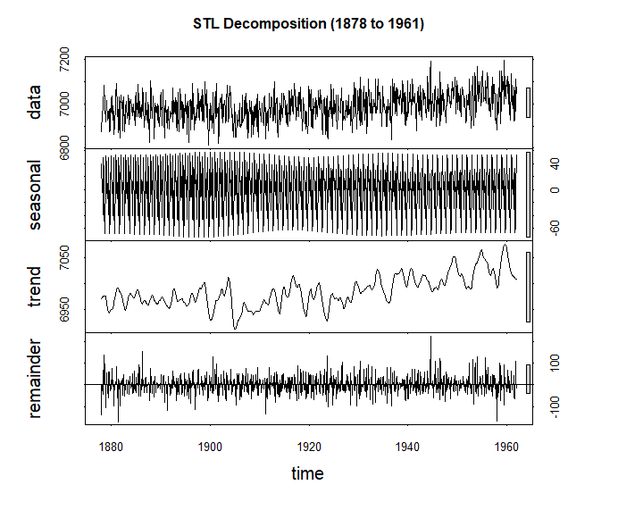
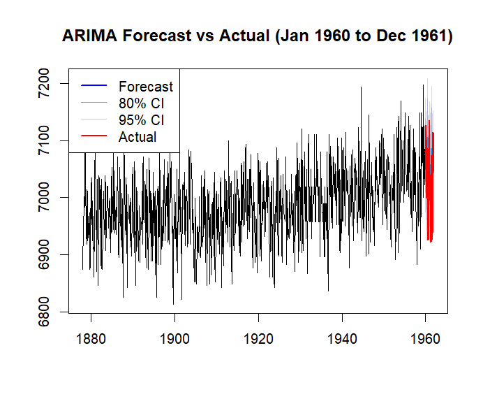
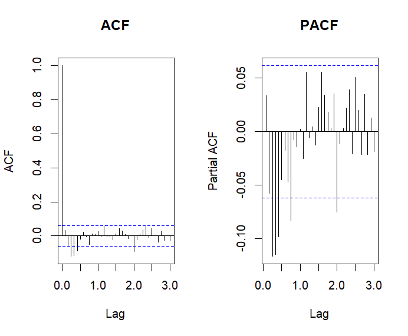
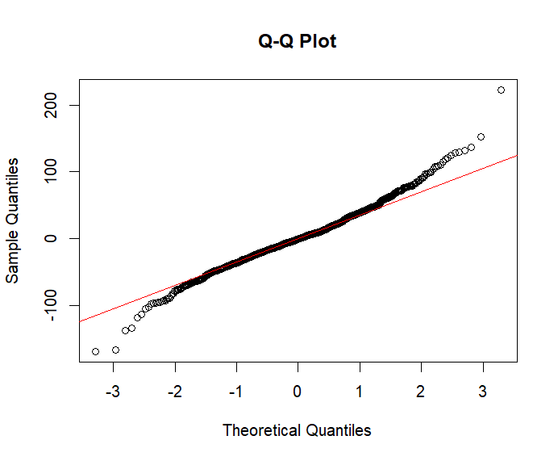

# Mumbai Sea Level Time Series Analysis (1878–1961)

<p align="center">
  
  
  
  
  
</p>

---

## Overview

Sea level rise is one of the most important indicators of long-term climate change. Understanding historical sea-level variability provides valuable insights into coastal dynamics, climate variability, and future environmental risks.

This project presents a comprehensive **time-series analysis** of monthly sea-level observations recorded at **Mumbai (Apollo Bandar), India**, from **1878 to 1961** using statistical and forecasting techniques in **R**.

The workflow includes data preprocessing, visualization, decomposition, statistical trend analysis, forecasting, and residual diagnostics to understand historical sea-level behaviour and evaluate model performance.

---

## 📊 Dataset

**Source**

**Permanent Service for Mean Sea Level (PSMSL)**

https://psmsl.org/data/obtaining/stations/43.php

**Station**

Mumbai (Apollo Bandar), India

| Attribute | Details |
|------------|---------|
| Time Period | **1878–1961** |
| Observations | **1008 Monthly Records** |
| Dataset Type | Gap-free Continuous Record |
| Quality | Quality-controlled observations |

---

# Workflow

```text
Raw Sea Level Data
        │
        ▼
Data Cleaning & Quality Control
        │
        ▼
Monthly Time Series Construction
        │
        ▼
Visualization
        │
        ▼
Trend Analysis
        │
        ▼
STL Decomposition
        │
        ▼
ARIMA Forecasting
        │
        ▼
Residual Diagnostics
```

---

# Statistical Methods

- Data Cleaning
- Monthly Time-Series Construction
- Annual Mean Analysis
- Linear Regression
- STL Decomposition
- Mann–Kendall Trend Test
- Seasonal Mann–Kendall Test
- Theil–Sen Slope Estimation
- Seasonal ARIMA Forecasting
- Forecast Accuracy Assessment
- Residual Diagnostics

---

# Results

The historical sea-level observations from **Mumbai (Apollo Bandar)** reveal a statistically significant long-term increase between **1878 and 1961**. Time-series decomposition, trend analysis, and forecasting consistently demonstrate rising sea levels while preserving seasonal variability.

---

## Mean Sea Level Rise

> **Figure 1.** Historical monthly sea-level observations (1878–1961).

The observed time series exhibits pronounced seasonal fluctuations superimposed on a persistent long-term increasing trend. Linear regression confirms a statistically significant rise in sea level throughout the 84-year observation period.

<p align="center">
  
</p>

---

## Sea Level Anomaly Stripes

> **Figure 2.** Annual sea-level anomalies relative to the long-term mean.

The anomaly stripe visualization illustrates the gradual transition from predominantly below-average conditions during the late nineteenth century to increasingly above-average sea levels during the mid-twentieth century.

<p align="center">
  
</p>

---

## STL Decomposition

> **Figure 3.** Seasonal-Trend decomposition using Loess (STL).

The observed series was decomposed into:

-  Trend
-  Seasonal
-  Residual

The decomposition demonstrates that long-term sea-level rise dominates the historical record while seasonal oscillations remain relatively stable.

<p align="center">
  
</p>

---

## Seasonally Adjusted Series

> **Figure 4.** Seasonally adjusted sea-level observations.

Removing the seasonal component highlights the underlying long-term trend, revealing a continuous increase in sea level with substantially reduced seasonal variability.

<p align="center">
  
</p>

---

## Statistical Trend Analysis

Multiple statistical approaches consistently confirmed a significant increasing trend in Mumbai's historical sea-level record.

| Method | Result |
|:--------|-------:|
| Linear Regression | **0.914 mm/year** |
| Mann–Kendall Test | **z = 6.68 (p < 0.001)** |
| Kendall's Tau | **0.497** |
| Theil–Sen Slope | **0.862 mm/year** |
| Seasonal Mann–Kendall | **z = 13.41 (p < 0.001)** |

> **Key Interpretation:** Both parametric and non-parametric methods independently confirm a robust and statistically significant long-term increase in sea level.

---

## ARIMA Forecasting

> **Figure 5.** Seasonal ARIMA forecast compared with observed values.

A Seasonal **ARIMA(0,1,3)(2,0,0)[12]** model was calibrated using observations from **1878–1959** and validated using the independent period **1960–1961**.

The model successfully reproduced seasonal variability and demonstrated strong short-term forecasting performance.

<p align="center">
  
</p>

### Forecast Performance

| Metric | Value |
|:--------|------:|
| RMSE | **61.77 mm** |
| MAE | **49.66 mm** |
| MAPE | **0.71%** |
| Theil's U | **0.81** |

> **Model Performance:** A **Theil's U value below 1** indicates that the ARIMA model outperformed a naïve forecasting approach, demonstrating reliable predictive capability.

---

## Residual Diagnostics

Residual diagnostics were performed to evaluate model adequacy.

### Autocorrelation Analysis

<p align="center">
  
</p>

### Normal Q–Q Plot

<p align="center">
  
</p>

The ACF and PACF plots indicate that the majority of temporal dependence has been successfully captured by the fitted ARIMA model. The Q–Q plot suggests that residuals are approximately normally distributed, indicating satisfactory model assumptions.

---

## Key Findings

- Analysed **1008 monthly sea-level observations** spanning **84 years (1878–1961)**.
- Linear regression estimated a long-term sea-level rise of **0.914 mm/year**.
- The **Mann–Kendall** and **Seasonal Mann–Kendall** tests confirmed a highly significant increasing trend (**p < 0.001**).
- The **Theil–Sen estimator** produced a robust trend estimate of **0.862 mm/year**.
- STL decomposition successfully separated long-term trends from seasonal variability.
- The Seasonal **ARIMA(0,1,3)(2,0,0)[12]** model accurately represented historical sea-level dynamics and achieved a **MAPE of 0.71%**.
- **Theil's U = 0.81** indicates that the forecasting model outperformed a naïve benchmark.
- Overall, the analyses consistently demonstrate a statistically significant long-term rise in Mumbai's historical sea level and highlight the effectiveness of classical time-series methods for analysing and forecasting coastal sea-level variability.


## Repository Structure

```text
Mumbai-Sea-Level-Time-Series/
│
├── data/
│   └── 43.rlrdata.txt              # PSMSL monthly sea-level dataset
│
├── scripts/
│   └── Sea_Level_Rise_Timeseries.R # Complete R workflow for analysis
│
├── figures/
│   ├── Mean sea level rise.png
│   ├── Sea level anomaly stripes.png
│   ├── STL.png
│   ├── Seasonally adjusted.png
│   ├── ARIMA.png
│   ├── ACF-PACF.png
│   └── Q-plot.png
│
├── report/
│   └── Timeseries_Assignment_Jyotiprakash_MSCC1250022.pdf
│
├── README.md
└── LICENSE

---

# Software & Packages

- R
- tidyverse
- ggplot2
- forecast
- trend
- zoo
- viridis
- RColorBrewer
- ggridges

---

# Future Improvements

- Prophet Forecasting
- Deep Learning (LSTM)
- Wavelet Analysis
- ENSO & Indian Ocean Dipole Correlation
- Satellite Altimetry Comparison
- Interactive Shiny Dashboard

---

# Author

## **Jyotiprakash G. Mirashi**

**M.Sc. Climate Change and Sustainability**

Azim Premji University, Bengaluru

### Research Interests

- Climate Analytics
- Environmental Data Science
- GIS & Remote Sensing
- Time-Series Analysis
- Carbon Dynamics
- Biodiversity Informatics

---

# Citation

```text
Mirashi, J. G. (2026)

Mumbai Sea Level Time Series Analysis (1878–1961)

GitHub Repository
```

---

# License

This project is licensed under the **MIT License**.

---

## Support

If you found this project useful, consider giving the repository a **Star ⭐**.
It helps others discover the project and supports my work in climate data science and environmental analytics.
